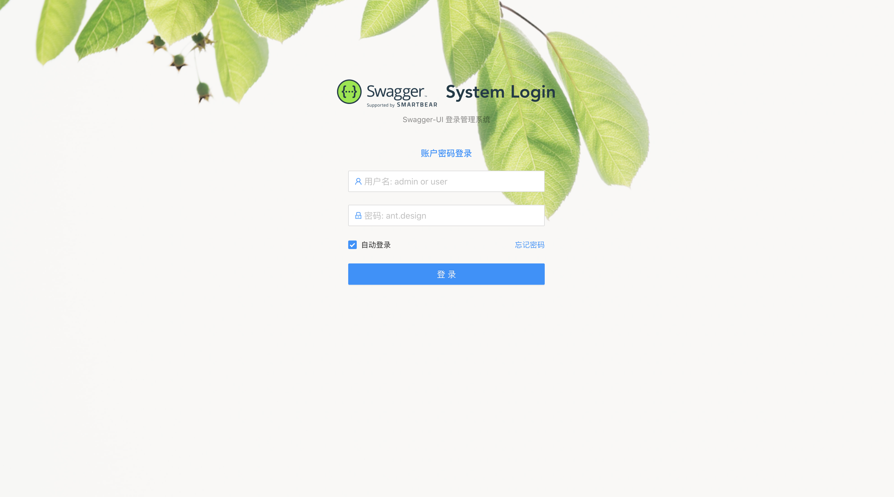
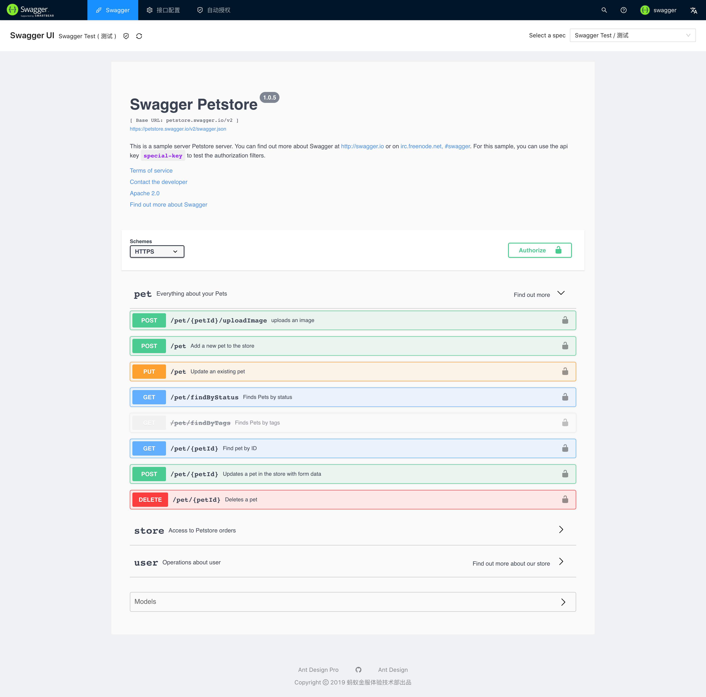
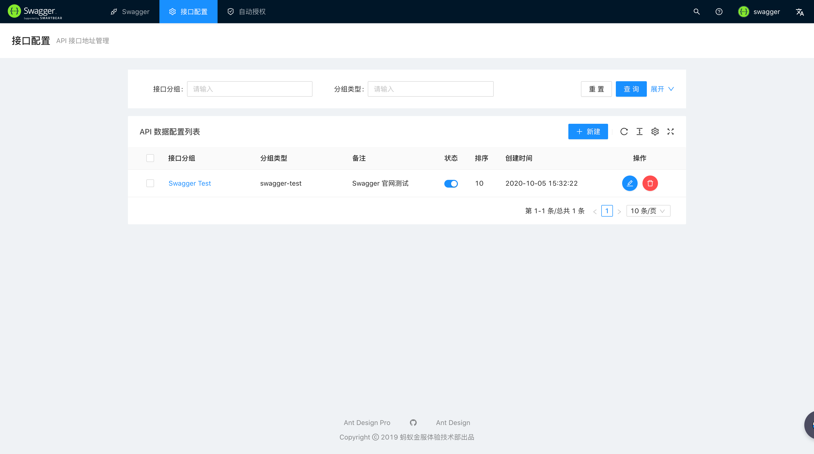
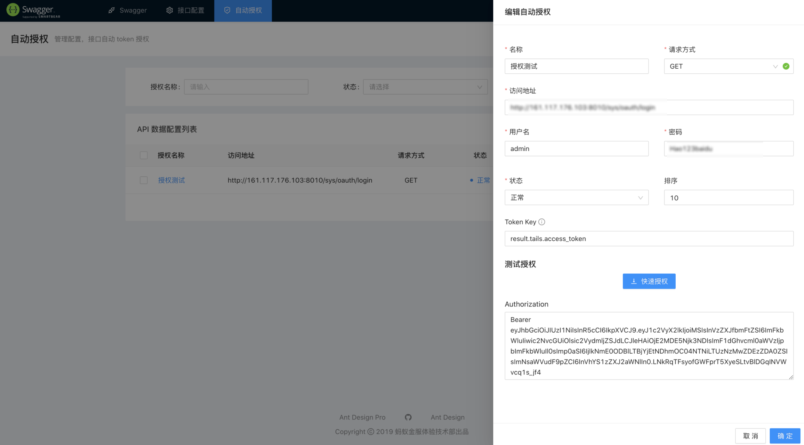

  
  
    Collector
  

## 介绍

`Swagger 文档收集器`，基于工作中各个项目API地址统一管理难的问题，特别创建了此项目可自由管理项目中各个swagger文档地址。 
同时可以动态设置开发与测试等访问地址。

- 支持项目级别发分组API管理。
- 支持动态设置Token。
- 无需与项目集合，只针对swagger api url进行动态管理。
- 支持可配置的密码登录。

## API使用文档

- [gitee](https://gitee.com/regan_jeff/swagger-collector/pages)
- [gitlab](https://basecode-group.gitlab.io/benson/swagger-collector/#/)

项目架构：`springboot`, `mybatis-plus`,`Antd pro 5`。

## 页面展示

- 登录页

- 接口页

- 接口配置项

- 授权配置

